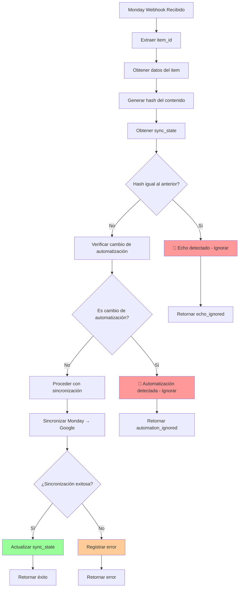
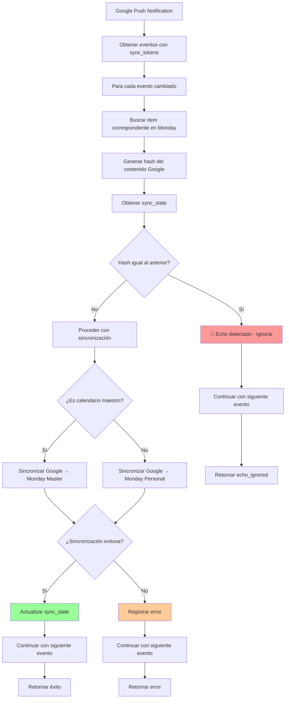

# Sistema de Sincronización Monday ↔ Google Calendar
## Documentación Completa y Guía de Configuración

---

## 📋 Tabla de Contenidos

1. [Descripción General](#descripción-general)
2. [Arquitectura del Sistema](#arquitectura-del-sistema)
3. [Diagrama de Flujo Anti-Bucles](#diagrama-de-flujo-anti-bucles)
4. [Configuración del Sistema](#configuración-del-sistema)
5. [Componentes Principales](#componentes-principales)
6. [Sistema de Tests y Monitoreo](#sistema-de-tests-y-monitoreo)
7. [Debugging y Troubleshooting](#debugging-y-troubleshooting)
8. [Comandos Útiles](#comandos-útiles)
9. [Checklist de Verificación](#checklist-de-verificación)
10. [Ejemplos de Uso](#ejemplos-de-uso)

---

## 🎯 Descripción General

El sistema de sincronización Monday ↔ Google Calendar es una solución robusta que mantiene sincronizados los eventos entre Monday.com y Google Calendar, evitando bucles infinitos mediante un sistema anti-bucles avanzado basado en hashes de contenido y detección de automatización.

### Características Principales

- ✅ **Sincronización bidireccional**: Monday ↔ Google Calendar
- ✅ **Sistema anti-bucles**: Prevención de bucles infinitos
- ✅ **Detección de automatización**: Evita sincronizar cambios automáticos
- ✅ **Estado persistente**: Gestión de estado en archivo JSON
- ✅ **Tests completos**: Sistema de pruebas sin crear bucles
- ✅ **Monitoreo en tiempo real**: Herramientas de debugging
- ✅ **Optimización de búsquedas**: Cache y queries optimizadas

---

## 🏗️ Arquitectura del Sistema

```
┌─────────────────┐    ┌─────────────────┐    ┌─────────────────┐
│   Monday.com    │    │   Sync Server   │    │ Google Calendar │
│                 │    │                 │    │                 │
│ ┌─────────────┐ │    │ ┌─────────────┐ │    │ ┌─────────────┐ │
│ │   Webhook   │◄┼────┼►│  app.py     │◄┼────┼►│   Push      │ │
│ │  (POST)     │ │    │ │  (Flask)    │ │    │ │ Notification│ │
│ └─────────────┘ │    │ └─────────────┘ │    │ └─────────────┘ │
│                 │    │                 │    │                 │
│ ┌─────────────┐ │    │ ┌─────────────┐ │    │ ┌─────────────┐ │
│ │   Items     │◄┼────┼►│sync_logic.py│◄┼────┼►│   Events    │ │
│ │  (Board)    │ │    │ │             │ │    │ │ (Calendar)  │ │
│ └─────────────┘ │    │ └─────────────┘ │    │ └─────────────┘ │
└─────────────────┘    └─────────────────┘    └─────────────────┘
                                │
                                ▼
                       ┌─────────────────┐
                       │ sync_state.json │
                       │ (Estado Pers.)  │
                       └─────────────────┘
```

### Componentes Clave

1. **Webhooks**: Monday.com y Google Calendar envían notificaciones
2. **Sync Server**: Servidor Flask que procesa las notificaciones
3. **Sync Logic**: Lógica de sincronización con detección de bucles
4. **State Manager**: Gestión persistente del estado de sincronización
5. **API Handlers**: Manejo de APIs de Monday y Google

---

## 🔄 Diagrama de Flujo Anti-Bucles

### Monday Webhook → Google Calendar



### Google Webhook → Monday



### Detección de Bucles

```mermaid
graph TD
    A[Evento de Sincronización] --> B[Registrar en SyncMonitor]
    B --> C[Obtener eventos recientes (30s)]
    C --> D[Contar eventos por item_id]
    D --> E{¿3+ eventos del mismo item?}
    
    E -->|Sí| F[🚨 BUCLE DETECTADO]
    E -->|No| G[Continuar normalmente]
    
    F --> H[Detener sincronización]
    F --> I[Log de alerta]
    F --> J[Notificar administrador]
    
    style F fill:#ff0000,color:#ffffff
    style H fill:#ff6666
    style I fill:#ff6666
    style J fill:#ff6666
```

---

## ⚙️ Configuración del Sistema

### Configuración Recomendada en `config.py`

```python
# ============================================================================
# SISTEMA ANTI-BUCLES
# ============================================================================

# Archivo de estado de sincronización
SYNC_STATE_FILE = "config/sync_state.json"

# Configuración de limpieza de estados
SYNC_STATE_TTL_DAYS = 30  # Días para mantener estados antiguos
SYNC_STATE_CLEANUP_INTERVAL = 24  # Horas entre limpiezas automáticas

# Detección de bucles
LOOP_DETECTION_WINDOW = 30  # Segundos para detectar bucles
MAX_SYNCS_PER_ITEM = 2  # Máximo de sincronizaciones por item en la ventana
LOOP_DETECTION_THRESHOLD = 3  # Umbral para considerar bucle

# Campos para generación de hash de contenido
CONTENT_HASH_FIELDS = ['fecha_inicio', 'name', 'operario']

# Detección de automatización
AUTOMATION_DETECTION_WINDOW = 10  # Segundos para detectar cambios de automatización
AUTOMATION_USER_NAME = "Arnau Admin"
AUTOMATION_USER_ID = 34210704

# Configuración de Monday.com
MONDAY_API_KEY = "tu_api_key_aqui"
BOARD_ID_GRABACIONES = 123456789
COL_FECHA = "fecha56"
COL_GOOGLE_EVENT_ID = "text_mktfdhm3"

# Configuración de Google Calendar
MASTER_CALENDAR_ID = "primary"
GOOGLE_CREDENTIALS_FILE = "config/google_credentials.json"

# Configuración del servidor
SERVER_PORT = 6754
SERVER_HOST = "0.0.0.0"
DEBUG_MODE = True

# Configuración de caché
CACHE_TTL_SECONDS = 300  # 5 minutos
MAX_SCAN_ITEMS = 200  # Máximo items a escanear en búsquedas

# Configuración de webhooks
WEBHOOK_TIMEOUT = 30  # Segundos de timeout para webhooks
WEBHOOK_RETRY_ATTEMPTS = 3  # Intentos de reintento

# Configuración de logging
LOG_LEVEL = "INFO"
LOG_FILE = "logs/sync_system.log"
LOG_FORMAT = "%(asctime)s - %(name)s - %(levelname)s - %(message)s"

# Configuración de monitoreo
MONITOR_CHECK_INTERVAL = 5  # Segundos entre verificaciones del monitor
MONITOR_HISTORY_SIZE = 1000  # Número máximo de eventos en historial
```

### Variables de Entorno (.env)

```bash
# Monday.com API
MONDAY_API_KEY=tu_api_key_aqui

# Google Calendar
GOOGLE_APPLICATION_CREDENTIALS=config/google_credentials.json

# Servidor
FLASK_ENV=development
FLASK_DEBUG=True

# Base de datos (si se usa)
DATABASE_URL=sqlite:///sync_system.db

# Logging
LOG_LEVEL=INFO
```

---

## 🔧 Componentes Principales

### 1. **SyncStateManager** - Gestión de Estado

```python
class SyncStateManager:
    def __init__(self, state_file_path="config/sync_state.json"):
        self.state_file_path = Path(state_file_path)
        self.lock = threading.RLock()
    
    def get_sync_state(self, item_id: str, event_id: str) -> Optional[Dict]
    def update_sync_state(self, item_id: str, event_id: str, **kwargs) -> bool
    def is_change_needed(self, item_id: str, event_id: str, new_hash: str, source: str) -> bool
    def cleanup_old_states(self, days_threshold: int = 30) -> int
```

**Funciones principales**:
- ✅ Gestión thread-safe del estado
- ✅ Detección de cambios basada en hashes
- ✅ Limpieza automática de estados antiguos
- ✅ Operaciones atómicas con archivos

### 2. **SyncLogic** - Lógica de Sincronización

```python
def generate_content_hash(content_data: Dict) -> str:
    """Genera hash MD5 determinístico del contenido relevante"""

def detect_real_change(item_id: str, event_id: str, content_hash: str, source: str) -> bool:
    """Detecta si un cambio es real o un eco"""

def _detectar_cambio_de_automatizacion(item_id: str, monday_handler) -> bool:
    """Detecta cambios realizados por automatización"""
```

**Características**:
- ✅ Generación de hashes determinísticos
- ✅ Detección de ecos de sincronización
- ✅ Análisis de activity_logs para automatización
- ✅ Prevención de bucles infinitos

### 3. **MondayAPIHandler** - API de Monday

```python
class MondayAPIHandler:
    def get_item_by_column_value(self, board_id: str, column_id: str, column_value: str) -> Optional[ItemInfo]
    def get_item_id_by_google_event_id(self, board_id: str, google_event_column_id: str, google_event_id: str) -> Optional[str]
    def update_column_value(self, item_id: str, board_id: str, column_id: str, value: Any, column_type: str) -> bool
```

**Optimizaciones**:
- ✅ Cache en memoria con TTL
- ✅ Queries optimizadas con `items_page_by_column_values`
- ✅ Búsquedas paginadas como fallback
- ✅ Invalidación automática de cache

---

## 🧪 Sistema de Tests y Monitoreo

### Tests Implementados

```bash
# Test completo del sistema
python3 scripts/testing/test_sync_system.py

# Test específico de detección de bucles
python3 scripts/testing/test_sync_system.py --test-loop-detection

# Test de consistencia de hashes
python3 scripts/testing/test_sync_system.py --test-hash-consistency
```

### Monitor en Tiempo Real

```bash
# Monitor interactivo
python3 scripts/testing/monitor_sync_realtime.py --mode interactive

# Monitor en tiempo real
python3 scripts/testing/monitor_sync_realtime.py --mode realtime

# Monitor con servidor personalizado
python3 scripts/testing/monitor_sync_realtime.py --server http://tu-servidor:6754
```

### Endpoints de Debugging

```bash
# Verificar salud del servidor
curl http://localhost:6754/health

# Obtener estadísticas del sistema
curl http://localhost:6754/debug/sync-monitor

# Ver últimas sincronizaciones
curl http://localhost:6754/debug/last-syncs

# Ver estado de un item específico
curl http://localhost:6754/debug/sync-state/123456789

# Limpiar estado de un item (para testing)
curl -X DELETE http://localhost:6754/debug/clear-state/123456789
```

---

## 🔍 Debugging y Troubleshooting

### Checklist de Debugging cuando hay Bucles

#### ✅ **Verificación de Estado**
- [ ] Verificar que `sync_state.json` tiene los hashes correctos
- [ ] Confirmar que el archivo no está corrupto
- [ ] Verificar permisos de escritura en el archivo
- [ ] Revisar tamaño del archivo (no debe ser excesivamente grande)

#### ✅ **Análisis de Monday.com**
- [ ] Revisar `activity_logs` en Monday del item problemático
- [ ] Verificar que `AUTOMATION_USER_ID` es correcto
- [ ] Confirmar que `AUTOMATION_USER_NAME` coincide
- [ ] Revisar permisos de API en Monday.com

#### ✅ **Análisis de Google Calendar**
- [ ] Verificar que los `sync_tokens` de Google están funcionando
- [ ] Confirmar que el calendario maestro está configurado correctamente
- [ ] Revisar permisos de Google Calendar API
- [ ] Verificar que los webhooks de Google están activos

#### ✅ **Análisis de Logs**
- [ ] Revisar logs de webhooks en ambas direcciones
- [ ] Buscar patrones de sincronización repetitiva
- [ ] Verificar timestamps de las sincronizaciones
- [ ] Identificar items específicos que causan bucles

#### ✅ **Uso del Monitor**
- [ ] Usar el monitor para ver el patrón del bucle
- [ ] Verificar estadísticas de sincronización
- [ ] Analizar eventos recientes
- [ ] Identificar la frecuencia de sincronizaciones

#### ✅ **Verificación de Configuración**
- [ ] Confirmar que `LOOP_DETECTION_WINDOW` es apropiado
- [ ] Verificar que `MAX_SYNCS_PER_ITEM` está configurado correctamente
- [ ] Revisar `CONTENT_HASH_FIELDS` para asegurar que incluye todos los campos relevantes
- [ ] Confirmar que `AUTOMATION_DETECTION_WINDOW` es adecuado

### Síntomas de Bucles

#### 🚨 **Síntomas Principales**
1. **Sincronizaciones repetitivas**: El mismo item se sincroniza constantemente
2. **Logs saturados**: Muchos logs de sincronización en poco tiempo
3. **Alto uso de CPU**: El servidor consume muchos recursos
4. **Errores de rate limiting**: APIs de Monday o Google devuelven errores 429
5. **Estados inconsistentes**: Los hashes no coinciden entre Monday y Google

#### 🔍 **Patrones de Bucle Comunes**
1. **Monday → Google → Monday**: Cambio en Monday, se propaga a Google, vuelve a Monday
2. **Google → Monday → Google**: Cambio en Google, se propaga a Monday, vuelve a Google
3. **Automatización → Manual**: Cambio automático, luego manual, luego automático
4. **Múltiples usuarios**: Diferentes usuarios modificando el mismo item

### Herramientas de Debugging

#### 📊 **Análisis de Estado**
```python
# Ver estado de un item específico
from sync_state_manager import get_sync_state
state = get_sync_state('item_id', 'event_id')
print(f"Estado: {state}")

# Ver todos los estados
from sync_state_manager import get_all_sync_keys
keys = get_all_sync_keys()
print(f"Total estados: {len(keys)}")

# Ver estadísticas
from sync_state_manager import get_sync_statistics
stats = get_sync_statistics()
print(f"Estadísticas: {stats}")
```

#### 🔍 **Análisis de Logs**
```bash
# Ver logs en tiempo real
tail -f logs/sync_system.log | grep "BUCLE\|ERROR\|WARNING"

# Buscar patrones de sincronización
grep "SYNC LOG" logs/sync_system.log | tail -20

# Analizar frecuencia de sincronizaciones
grep "monday → google" logs/sync_system.log | wc -l
```

#### 🧪 **Tests de Diagnóstico**
```bash
# Test de detección de automatización
python3 scripts/testing/test_detection_automatizacion.py

# Test de consistencia de hashes
python3 scripts/testing/test_simple_detection.py

# Test de rendimiento de búsquedas
python3 scripts/testing/test_search_performance.py
```

---

## 💻 Comandos Útiles

### Gestión de Estado

```bash
# Ver estado de un item específico
python -c "
from sync_state_manager import get_sync_state
state = get_sync_state('item_id', 'event_id')
print(f'Estado: {state}')
"

# Limpiar estado corrupto
python -c "
from sync_state_manager import SyncStateManager
s = SyncStateManager()
cleaned = s.cleanup_old_states()
print(f'Estados limpiados: {cleaned}')
"

# Resetear estado de un item específico
python -c "
from sync_state_manager import reset_sync_state
reset_sync_state('item_id', 'event_id')
print('Estado reseteado')
"

# Ver estadísticas del sistema
python -c "
from sync_state_manager import get_sync_statistics
stats = get_sync_statistics()
print(f'Estadísticas: {stats}')
"
```

### Tests de Sincronización

```bash
# Test completo del sistema
python3 scripts/testing/test_sync_system.py

# Test con item específico
python3 scripts/testing/test_sync_system.py --test-item-id=123456

# Test de detección de bucles
python3 scripts/testing/test_sync_system.py --test-loop-detection

# Test de consistencia de hashes
python3 scripts/testing/test_sync_system.py --test-hash-consistency
```

### Monitoreo

```bash
# Monitor interactivo
python3 scripts/testing/monitor_sync_realtime.py --mode interactive

# Monitor en tiempo real
python3 scripts/testing/monitor_sync_realtime.py --mode realtime

# Monitor con servidor específico
python3 scripts/testing/monitor_sync_realtime.py --server http://localhost:6754
```

### Debugging de APIs

```bash
# Verificar Monday API
python -c "
from monday_api_handler import MondayAPIHandler
handler = MondayAPIHandler('api_key')
items = handler.get_items(board_id='123456789', limit_per_page=5)
print(f'Items encontrados: {len(items)}')
"

# Verificar Google Calendar API
python -c "
from google_calendar_service import get_calendar_service
service = get_calendar_service()
calendars = service.calendarList().list().execute()
print(f'Calendarios: {len(calendars.get(\"items\", []))}')
"
```

### Limpieza y Mantenimiento

```bash
# Limpiar cache de Monday
python -c "
from monday_api_handler import MondayAPIHandler
handler = MondayAPIHandler('api_key')
handler.invalidate_cache()
print('Cache limpiado')
"

# Limpiar estados antiguos
python -c "
from sync_state_manager import SyncStateManager
s = SyncStateManager()
cleaned = s.cleanup_old_states(days_threshold=7)
print(f'Estados limpiados: {cleaned}')
"

# Verificar archivos de configuración
ls -la config/
cat config/sync_state.json | jq '.' | head -20
```

---

## ✅ Checklist de Verificación

### Configuración Inicial

#### ✅ **Monday.com**
- [ ] API Key configurada y válida
- [ ] Board ID correcto
- [ ] Columnas configuradas (fecha, Google Event ID, operarios)
- [ ] Webhook configurado y activo
- [ ] Usuario de automatización identificado

#### ✅ **Google Calendar**
- [ ] Credenciales configuradas
- [ ] Calendario maestro identificado
- [ ] Webhook push configurado
- [ ] Sync tokens funcionando
- [ ] Permisos de API correctos

#### ✅ **Servidor**
- [ ] Puerto configurado (6754)
- [ ] Variables de entorno cargadas
- [ ] Archivos de configuración en su lugar
- [ ] Permisos de escritura en config/
- [ ] Logs configurados

### Verificación de Funcionamiento

#### ✅ **Sincronización Monday → Google**
- [ ] Webhook de Monday responde correctamente
- [ ] Detección de ecos funciona
- [ ] Detección de automatización funciona
- [ ] Estado se actualiza correctamente
- [ ] No se crean bucles

#### ✅ **Sincronización Google → Monday**
- [ ] Push notifications de Google llegan
- [ ] Sync tokens funcionan correctamente
- [ ] Búsqueda de items en Monday es eficiente
- [ ] Estado se actualiza correctamente
- [ ] No se crean bucles

#### ✅ **Sistema Anti-Bucles**
- [ ] Detección de bucles funciona
- [ ] Estados se mantienen consistentes
- [ ] Limpieza automática funciona
- [ ] Logs son claros y útiles
- [ ] Monitor detecta problemas

### Monitoreo Continuo

#### ✅ **Logs**
- [ ] Logs se escriben correctamente
- [ ] Nivel de logging apropiado
- [ ] Rotación de logs configurada
- [ ] Logs contienen información útil

#### ✅ **Estado**
- [ ] Archivo de estado no crece indefinidamente
- [ ] Estados se actualizan correctamente
- [ ] Limpieza automática funciona
- [ ] No hay estados corruptos

#### ✅ **Rendimiento**
- [ ] Búsquedas son rápidas (<500ms)
- [ ] Cache funciona correctamente
- [ ] No hay memory leaks
- [ ] CPU usage es razonable

---

## 📝 Ejemplos de Uso

### Ejemplo 1: Configuración Inicial

```bash
# 1. Configurar variables de entorno
cp .env.example .env
# Editar .env con tus credenciales

# 2. Instalar dependencias
pip install -r requirements.txt

# 3. Configurar Google Calendar
python3 scripts/testing/configurar_google_webhook.py

# 4. Configurar Monday webhook
python3 scripts/testing/configurar_webhook_monday.py

# 5. Ejecutar tests iniciales
python3 scripts/testing/test_sync_system.py

# 6. Iniciar servidor
python3 app.py
```

### Ejemplo 2: Debugging de un Bucle

```bash
# 1. Identificar el item problemático
python3 scripts/testing/monitor_sync_realtime.py --mode interactive
# Usar comando 'activity' para ver actividad reciente

# 2. Ver estado del item
curl http://localhost:6754/debug/sync-state/123456789

# 3. Limpiar estado del item
curl -X DELETE http://localhost:6754/debug/clear-state/123456789

# 4. Ejecutar test específico
python3 scripts/testing/test_sync_system.py --test-item-id=123456789

# 5. Monitorear en tiempo real
python3 scripts/testing/monitor_sync_realtime.py --mode realtime
```

### Ejemplo 3: Mantenimiento Rutinario

```bash
# 1. Verificar salud del sistema
curl http://localhost:6754/health

# 2. Limpiar estados antiguos
python -c "
from sync_state_manager import SyncStateManager
s = SyncStateManager()
cleaned = s.cleanup_old_states(days_threshold=30)
print(f'Estados limpiados: {cleaned}')
"

# 3. Verificar estadísticas
curl http://localhost:6754/debug/sync-monitor

# 4. Limpiar cache
python -c "
from monday_api_handler import MondayAPIHandler
handler = MondayAPIHandler('api_key')
handler.invalidate_cache()
print('Cache limpiado')
"

# 5. Ejecutar tests de regresión
python3 scripts/testing/test_sync_system.py
```

### Ejemplo 4: Análisis de Problemas

```bash
# 1. Ver logs recientes
tail -f logs/sync_system.log | grep -E "(ERROR|WARNING|BUCLE)"

# 2. Analizar patrones de sincronización
grep "SYNC LOG" logs/sync_system.log | tail -50 | \
  awk '{print $1, $2, $NF}' | sort | uniq -c | sort -nr

# 3. Verificar actividad de Monday
python3 scripts/testing/test_detection_automatizacion.py

# 4. Verificar consistencia de hashes
python3 scripts/testing/test_simple_detection.py

# 5. Generar reporte de estado
python -c "
from sync_state_manager import get_sync_statistics
stats = get_sync_statistics()
print('=== REPORTE DE ESTADO ===')
print(f'Total estados: {stats.get(\"total_states\", 0)}')
print(f'Última limpieza: {stats.get(\"last_cleanup\", \"N/A\")}')
print(f'Estados antiguos eliminados: {stats.get(\"old_states_removed\", 0)}')
"
```

---

## 🎯 Conclusión

El sistema de sincronización Monday ↔ Google Calendar proporciona una solución robusta y confiable para mantener sincronizados los eventos entre ambas plataformas. Con su sistema anti-bucles avanzado, herramientas de monitoreo completas y documentación detallada, es capaz de manejar entornos de producción complejos sin crear bucles infinitos.

### Puntos Clave

- ✅ **Sistema anti-bucles robusto**: Basado en hashes de contenido y detección de automatización
- ✅ **Herramientas de debugging completas**: Monitor en tiempo real y endpoints de debugging
- ✅ **Tests exhaustivos**: Sistema de pruebas que no crea bucles
- ✅ **Documentación detallada**: Guías completas para configuración y troubleshooting
- ✅ **Configuración flexible**: Adaptable a diferentes entornos y necesidades

Este sistema es fundamental para mantener la estabilidad y eficiencia de la integración Monday.com ↔ Google Calendar en entornos de producción.
